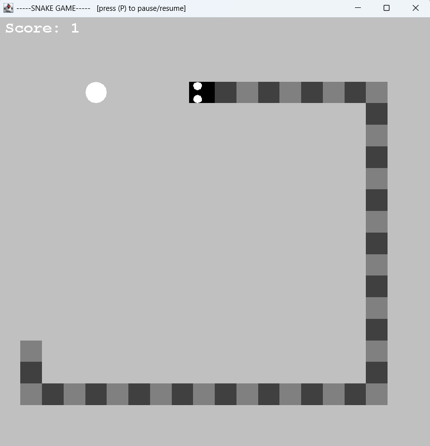

# snake-game

A classic Snake Game built in Java. 

### Overview
The player controls a snake which grows longer as it consumes food. \
The game ends when the snake hits the boundaries or itself. 

### Code Structure
-**SnakeGame.java:** Contains the main entry point and game loop. 

### Setup
-**Just run the program:** \
From Eclipse, right-click on SnakeGame.java and select "Run As" > "1 Java Application". \
The welcome screen will appear. Then press (S) to start the game. 

### How to Play
-**Controls:** \
Use the arrow keys to navigate the snake. You can pause/resume the game by pressing (P). \
While in the game over screen restart by pressing (R). \
-**Objective:** \
Eat the food to grow longer while avoiding collisions with the walls or the snake’s own body. \
The more food you eat the higher the score. Achieve the highest score to win! 

### Acknowledgments
Microsoft/GitHub Copilot for code suggestions. 

